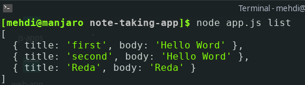
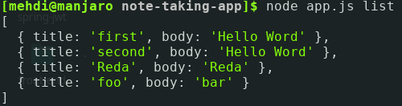
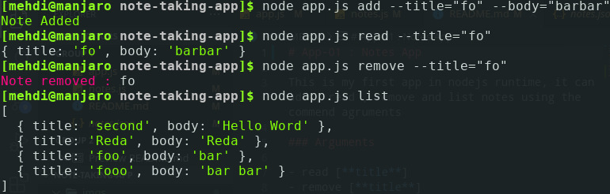

# App-01 : Notes App

This is my first app in nodejs runtime, it can add , read , remove and list notes using the commend agruments

## Arguments

- read [**title**]
- remove [**title**]
- add [**title**] [**body**]
- list

## Images

**Listing Notes**

**Manipulating Notes**

### made with **<3** in Morocco
