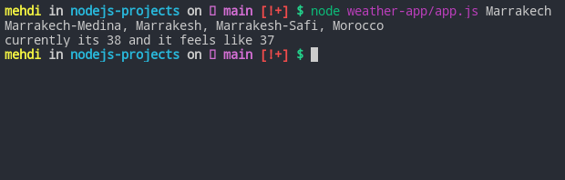

# Weather App (CLI)

CONTACT : elwafi.courrier99@gmail.com  
DATE : 28/08/2021

## How To

---

First you need to run `npm install`  
and then you can run `node app.js <location>`

**Lets see an exemple :**

## API

-   Weatherstack
-   Mapbox

## Project File Structure

**weather-app**  
├── app.js  
├── node_modules  
├── package.json  
├── package-lock.json  
└── utils
