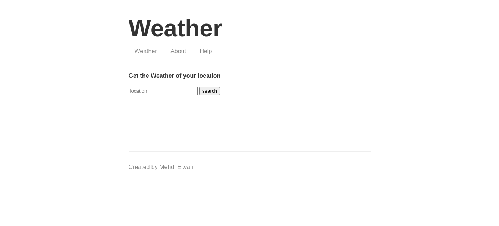
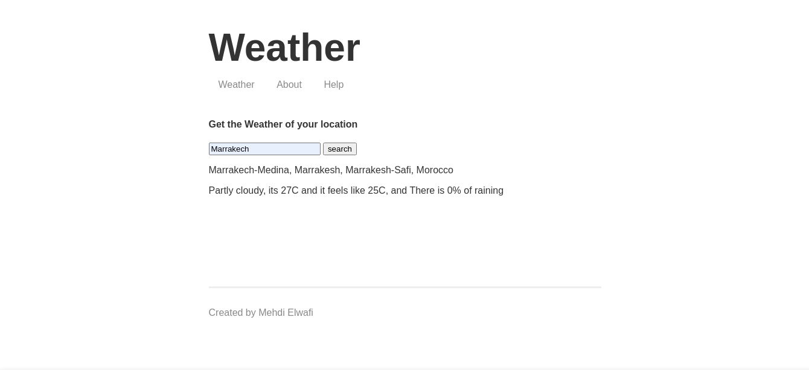
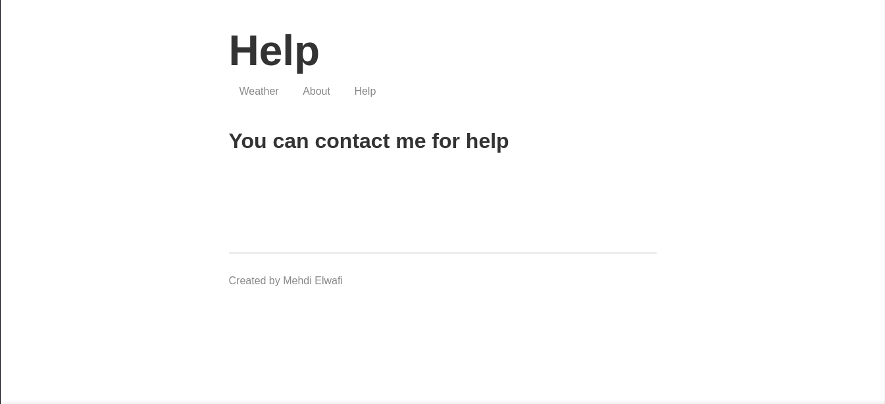
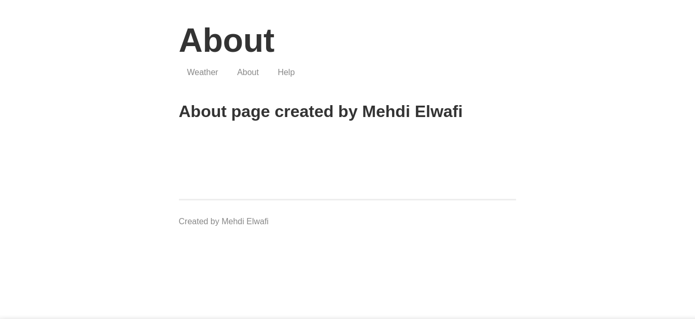

# Weather Web App

CONTACT : elwafi.courrier99@gmail.com  
DATE : 28/08/2021  
CHECK APP : [Heroku](https://elwafi-weather-app.herokuapp.com/)

## How To

First you need to run `npm install`  
and then you can run `npm run start`  
After that you can acess `localhost:3000`

## API

-   Weatherstack
-   Mapbox

## App Images

**Main Page**

**Search Result**

**Help Page**

**About Page**

## Project File Structure

**web-server**  
├── node_modules  
├── package.json  
├── package-lock.json  
├── public  
├── README.md  
├── src  
└── templates
